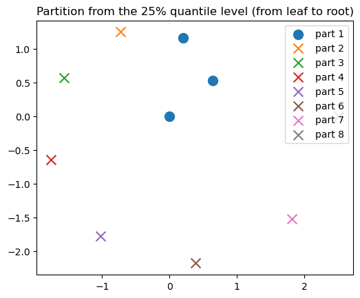
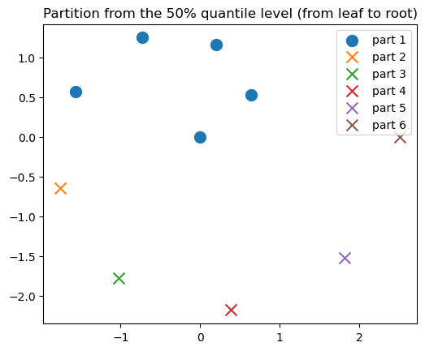
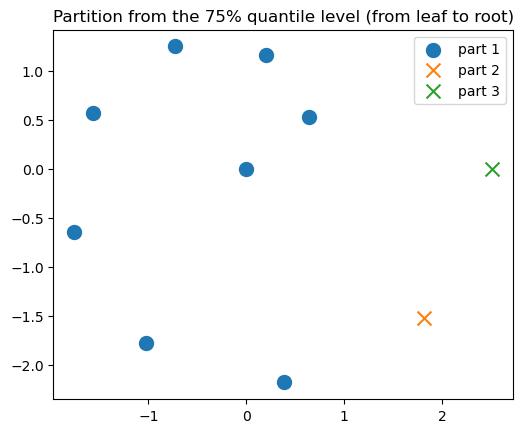
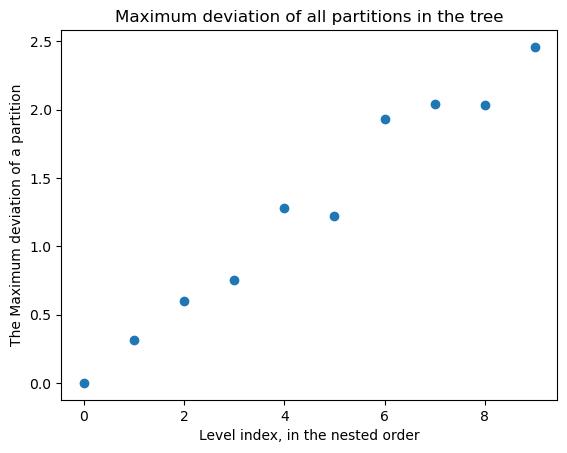
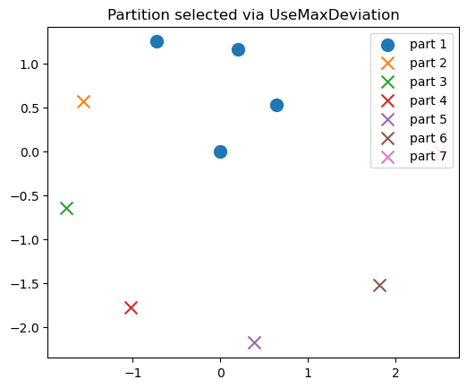
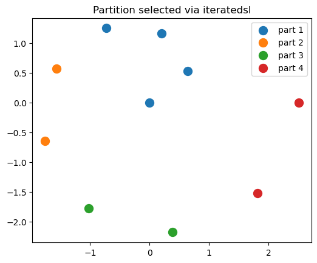

```@meta
EditURL = "../../../examples/chaining.jl"
```

run the contents of preproc.txt to generate markdown. # hide

# Load dependencies for this demo
run using Pkg; Pkg.add("name-of-dependency) if you have missing dependencies.

````julia
import SingleLinkagePartitions as SL

import PythonPlot as PLT # visualization

using LinearAlgebra
import Statistics

import Random
Random.seed!(25)

PLT.close("all")
fig_num = 1
````

````
1
````

# Set up data

````julia
T = Float64
D = 2;
````

oracle set to one branch of Fermat's spiral

````julia
f = tt->(sqrt(tt) .* [cos(tt); sin(tt)]);
````

sample data from the oracle to get our 2-D point set, X.

````julia
N = 10
ts = LinRange(0, 2*π, N)
X = collect( f(t) for t in ts ); # this is our data, the input point set for this demo.
````

visualize the data.

````julia
plot_x = collect( X[n][begin] for n in eachindex(X) )
plot_y = collect( X[n][begin+1] for n in eachindex(X) )

PLT.figure(fig_num)
fig_num += 1
PLT.scatter(plot_x, plot_y, marker = "x")
PLT.axis("scaled")
PLT.title("Input point set")
PLT.gcf()
````


## Single-linkage clustering
Single-linkage clustering is a method to generate a partition tree, which is a set of nested partitions.
First, specify the distance metric.

````julia
metric = SL.geteuclideanmetric()
````

````
SingleLinkagePartitions.DistancesjlMetric{Distances.Euclidean}(Distances.Euclidean(0.0))
````

### Generate partition tree

````julia
pt = SL.computesl(metric, X)
````

````
SingleLinkagePartitions.PartitionTree{Float64}(10, [2, 1, 3, 4, 5, 6, 7, 8, 9], [3, 2, 4, 5, 6, 7, 8, 9, 10], [0.7627270355420898, 0.8355427582103335, 0.9331048795315017, 1.087069198275422, 1.2246589300873207, 1.3494477463111696, 1.4642107178915054, 1.5709307361417881, 1.6710426337120232])
````

The minimum distances between the nested partitions.

````julia
distance_set = SL.getdistances(pt) # length(distance_set) == length(X) - 1.
````

````
9-element Vector{Float64}:
 0.7627270355420898
 0.8355427582103335
 0.9331048795315017
 1.087069198275422
 1.2246589300873207
 1.3494477463111696
 1.4642107178915054
 1.5709307361417881
 1.6710426337120232
````

The nested partitions in the partition tree.

````julia
partition_set = SL.generateallpartitions(pt) # length(partition_set) == length(X).
````

````
10-element Vector{Vector{Vector{Int64}}}:
 [[1], [2], [3], [4], [5], [6], [7], [8], [9], [10]]
 [[1], [2, 3], [4], [5], [6], [7], [8], [9], [10]]
 [[1, 2, 3], [4], [5], [6], [7], [8], [9], [10]]
 [[1, 2, 3, 4], [5], [6], [7], [8], [9], [10]]
 [[1, 2, 3, 4, 5], [6], [7], [8], [9], [10]]
 [[1, 2, 3, 4, 5, 6], [7], [8], [9], [10]]
 [[1, 2, 3, 4, 5, 6, 7], [8], [9], [10]]
 [[1, 2, 3, 4, 5, 6, 7, 8], [9], [10]]
 [[1, 2, 3, 4, 5, 6, 7, 8, 9], [10]]
 [[1, 2, 3, 4, 5, 6, 7, 8, 9, 10]]
````

visualize a few partitions at different levels

````julia
marker_size = 100.5
max_level = SL.getmaxlevel(pt)
````

````
9
````

25 percent from leaf (all singleton parts) to root (every point is in the same part).

````julia
level = round(Int, Statistics.quantile(0:max_level, 0.25))
partition = SL.getpartition(pt, level)

title_string = "Partition from the 25% quantile level (from leaf to root)"
ARGS = (partition, title_string, X, fig_num, marker_size) # hide

partition, title_string, X, fig_num, marker_size = ARGS

PLT.figure(fig_num)
fig_num += 1

for k in eachindex(partition)
    X_part = X[partition[k]]
    plot_x = collect( X_part[n][begin] for n in eachindex(X_part) )
    plot_y = collect( X_part[n][begin+1] for n in eachindex(X_part) )

    if length(X_part) < 2
        PLT.scatter(plot_x, plot_y, s = marker_size, label = "part $k", marker = "x")
    else
        PLT.scatter(plot_x, plot_y, s = marker_size, label = "part $k")
    end
end

PLT.axis("scaled")
PLT.title(title_string)
PLT.legend()
PLT.gcf()
````


50 percent from leaf (all singleton parts) to root (every point is in the same part).

````julia
level = round(Int, Statistics.quantile(0:max_level, 0.50))
partition = SL.getpartition(pt, level)

title_string = "Partition from the 50% quantile level (from leaf to root)"
ARGS = (partition, title_string, X, fig_num, marker_size) # hide

partition, title_string, X, fig_num, marker_size = ARGS

PLT.figure(fig_num)
fig_num += 1

for k in eachindex(partition)
    X_part = X[partition[k]]
    plot_x = collect( X_part[n][begin] for n in eachindex(X_part) )
    plot_y = collect( X_part[n][begin+1] for n in eachindex(X_part) )

    if length(X_part) < 2
        PLT.scatter(plot_x, plot_y, s = marker_size, label = "part $k", marker = "x")
    else
        PLT.scatter(plot_x, plot_y, s = marker_size, label = "part $k")
    end
end

PLT.axis("scaled")
PLT.title(title_string)
PLT.legend()
PLT.gcf()
````


75 percent from leaf (all singleton parts) to root (every point is in the same part).

````julia
level = round(Int, Statistics.quantile(0:max_level, 0.75))
partition = SL.getpartition(pt, level)

title_string = "Partition from the 75% quantile level (from leaf to root)"
ARGS = (partition, title_string, X, fig_num, marker_size) # hide

partition, title_string, X, fig_num, marker_size = ARGS

PLT.figure(fig_num)
fig_num += 1

for k in eachindex(partition)
    X_part = X[partition[k]]
    plot_x = collect( X_part[n][begin] for n in eachindex(X_part) )
    plot_y = collect( X_part[n][begin+1] for n in eachindex(X_part) )

    if length(X_part) < 2
        PLT.scatter(plot_x, plot_y, s = marker_size, label = "part $k", marker = "x")
    else
        PLT.scatter(plot_x, plot_y, s = marker_size, label = "part $k")
    end
end

PLT.axis("scaled")
PLT.title(title_string)
PLT.legend()
PLT.gcf()
````


We can see that only a single part gets larger and larger. This is because the minimum distance between all parts for a partition at a given level is one that involves the large part. This is a known characteristic with single-linkage clustering, which may be something that is desirable or undesirable, depending on the application.

## Select a level (i.e. partition) via conditions
The conditions implemented are: `UseMaxDeviation`, `UseSLDistance`, and `UseCumulativeSLDistance`. We'll focus on `UseMaxDeviation` in this demo. The docstrings for `UseSLDistance` and `UseCumulativeSLDistance` should be self-explantory, and the method `picklevel` that we'll describe is impelemnted for them as well.

### `UseMaxDeviation`: Deivation from part/cluster mean/centroid.
Please review the terminology section before proceeding. First, specify an allowed deviation distance.

````julia
max_dev = pt.w[end]/2 # we arbitrarily choose half of the largest single-linkage distance from the tree.
level_config = SL.UseMaxDeviation(max_dev)

level = SL.picklevel(level_config, pt, X) # pick level via binary search.
partition = SL.getpartition(pt, level)
````

````
7-element Vector{Vector{Int64}}:
 [1, 2, 3, 4]
 [5]
 [6]
 [7]
 [8]
 [9]
 [10]
````

We see that the maximum deviation sequence when ordered by the nesting order of the partition tree (i.e. from level = 0 the leaf to level == getmaxlevel(pt) the root) is approximately monotonic.

````julia
max_ds = collect(
    SL.computemaxdeviation(X, pt, level)
    for level in 0:(SL.getmaxlevel(pt))
)
PLT.figure(fig_num)
fig_num += 1
PLT.plot(0:(SL.getmaxlevel(pt)), max_ds, "o")
#PLT.axis("scaled")
PLT.xlabel("Level index, in the nested order")
PLT.ylabel("The Maximum deviation of a partition")
PLT.title("Maximum deviation of all partitions in the tree")
PLT.gcf()
````


Since it is approximately monotonic, we use a bracketed binary search to select a partition such that its maximum deviation is approximate the best match from all the partitions to the specified value `max_dev`. We then do a linear search from this search result in the reverse nesting order to find the first partition that has a smaller maximum deviation. Please see the terminology section for details.
One can alternatively do a linear search over `max_ds` to pick a level, which is easy to implement yourself given `max_ds``.

````julia
level = SL.picklevel(level_config, pt, X) # pick level via binary search.
partition = SL.getpartition(pt, level) # instantiate the partition given the level and tree.

println("Target maximum deviation: ", max_dev)
println("Selected partition's maximum deviation: ", SL.computemaxdeviation(X, pt, level));
````

````
Target maximum deviation: 0.8355213168560116
Selected partition's maximum deviation: 0.7540138928489456

````

visualize

````julia
title_string = "Partition selected via UseMaxDeviation"
ARGS = (partition, title_string, X, fig_num, marker_size) # hide

partition, title_string, X, fig_num, marker_size = ARGS

PLT.figure(fig_num)
fig_num += 1

for k in eachindex(partition)
    X_part = X[partition[k]]
    plot_x = collect( X_part[n][begin] for n in eachindex(X_part) )
    plot_y = collect( X_part[n][begin+1] for n in eachindex(X_part) )

    if length(X_part) < 2
        PLT.scatter(plot_x, plot_y, s = marker_size, label = "part $k", marker = "x")
    else
        PLT.scatter(plot_x, plot_y, s = marker_size, label = "part $k")
    end
end

PLT.axis("scaled")
PLT.title(title_string)
PLT.legend()
PLT.gcf()
````


# Iterated single-linkage to reduce chaining
If it is desirable to reduce chaining, then we can use an iterated version of picklevel(). So far, only `UseMaxDeviation` is implemented for iteration.
We need to specify the iteration, namely a discount factor-like parameter that characterizes our acceptance of a selected partition in every iteration.

````julia
acceptance_factor = 0.99
````

````
0.99
````

`acceptance_factor` is a value in (0,1). closest to 1 means almost only the part with the maximum dev is added to P. A larger value for `acceptance_factor`` tend to yield fewer parts in the final P.

Run the iteration to assemble a partition `P` of `X` that has less chaining behavior. Note that `P` is not from the set of nested partitions in the single-linkage partition tree of `X`. See the terminology section of the documentation website for more details.

````julia
P, iters_ran = SL.iteratedsl(
    level_config,
    SL.geteuclideanmetric(),
    X;
    acceptance_factor = acceptance_factor,
    max_iter = 100,
)
max_dev_P = SL.computemaxdeviation(X, partition)
````

````
0.7540138928489456
````

visualize

````julia
partition = P
title_string = "Partition selected via iteratedsl"
ARGS = (partition, title_string, X, fig_num, marker_size) # hide

partition, title_string, X, fig_num, marker_size = ARGS

PLT.figure(fig_num)
fig_num += 1

for k in eachindex(partition)
    X_part = X[partition[k]]
    plot_x = collect( X_part[n][begin] for n in eachindex(X_part) )
    plot_y = collect( X_part[n][begin+1] for n in eachindex(X_part) )

    if length(X_part) < 2
        PLT.scatter(plot_x, plot_y, s = marker_size, label = "part $k", marker = "x")
    else
        PLT.scatter(plot_x, plot_y, s = marker_size, label = "part $k")
    end
end

PLT.axis("scaled")
PLT.title(title_string)
PLT.legend()
PLT.gcf()
````


This concludes the demo

````julia
nothing # hide
````

---

*This page was generated using [Literate.jl](https://github.com/fredrikekre/Literate.jl).*

