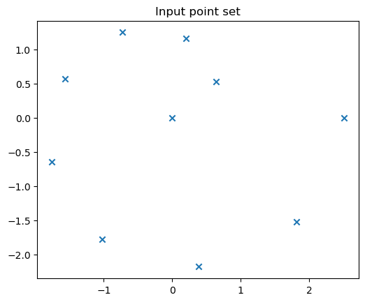
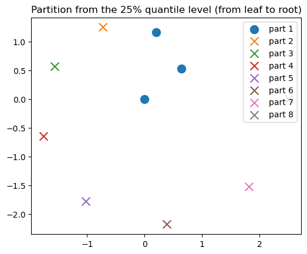
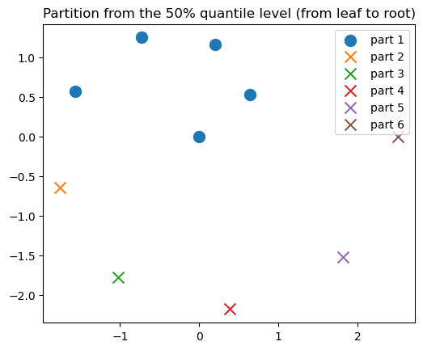
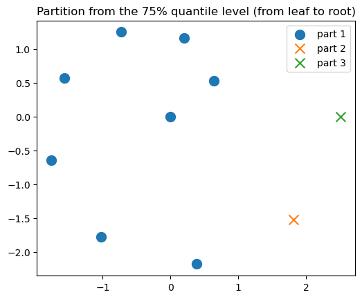
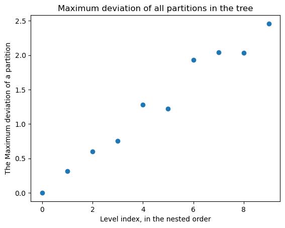
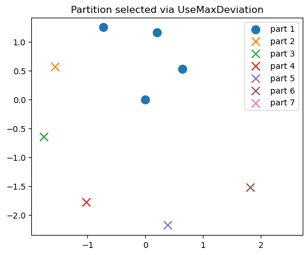
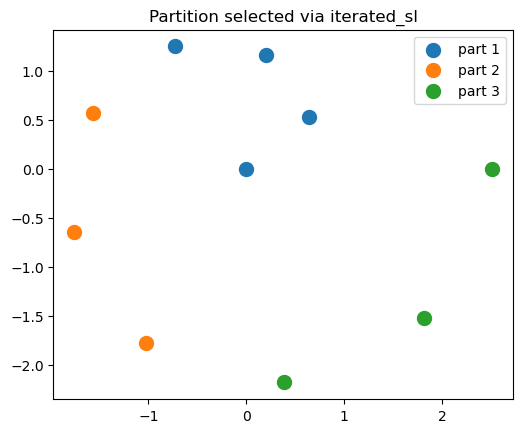

```@meta
EditURL = "../../../examples/chaining.jl"
```

run the contents of preproc.txt to generate markdown.

# Load dependencies for this demo
run `using Pkg; Pkg.add("name-of-dependency)` if you have missing dependencies.

````julia
import SingleLinkagePartitions as SL

import PythonPlot as PLT # visualization

using LinearAlgebra
import Statistics

import Random
Random.seed!(25)

PLT.close("all")
fig_num = 1
````

````
1
````

# Set up data

````julia
T = Float64
D = 2;
dist_callable = SL.EuclideanDistance()
````

````
SingleLinkagePartitions.EuclideanDistance()
````

oracle set to one branch of Fermat's spiral

````julia
f = tt -> (sqrt(tt) .* [cos(tt); sin(tt)]);
````

sample data from the oracle to get our 2-D point set, `X`.

````julia
N = 10
ts = LinRange(0, 2 * π, N)
X = collect(f(t) for t in ts);
````

visualize the data.

````julia
plot_x = collect(X[n][begin] for n in eachindex(X))
plot_y = collect(X[n][begin + 1] for n in eachindex(X))

PLT.figure(fig_num)
fig_num += 1
PLT.scatter(plot_x, plot_y, marker = "x")
PLT.axis("scaled")
PLT.title("Input point set")
PLT.gcf()
````


## Single-linkage clustering
Single-linkage clustering is a method to generate a partition tree, which is a set of nested partitions.

Allocate state/buffer.

````julia
s = SL.SLINKState(T, N)
````

````
SingleLinkagePartitions.SLINKState{Float64}([0.0, 0.0, 0.0, 0.0, 0.0, 0.0, 0.0, 0.0, 0.0, 0.0], [5.0e-324, 6.93341592494787e-310, 5.0e-324, 6.93341592494945e-310, 5.0e-324, 6.93341592495103e-310, 5.0e-324, 6.9334159249526e-310, 5.0e-324, 6.9334159249542e-310], [4294967297, 4294967297, 4294967297, 4294967297, 34359738376, 34359738376, 38654705673, 42949672970, 47244640267, 12])
````

Run the SLINK algorithm. This computes the essential data required to construct the partition tree.

````julia
SL.slink!(s, dist_callable, X)
````

Construct all partitions, indexed from `0` to `get_max_level(s)`.

````julia
partition_tree = SL.construct_partition_tree(s)
````

````
10-element Memory{Memory{Memory{Int64}}}:
 [[1], [2], [3], [4], [5], [6], [7], [8], [9], [10]]
 [[1], [2, 3], [4], [5], [6], [7], [8], [9], [10]]
 [[1, 2, 3], [4], [5], [6], [7], [8], [9], [10]]
 [[1, 2, 3, 4], [5], [6], [7], [8], [9], [10]]
 [[1, 2, 3, 4, 5], [6], [7], [8], [9], [10]]
 [[1, 2, 3, 4, 5, 6], [7], [8], [9], [10]]
 [[1, 2, 3, 4, 5, 6, 7], [8], [9], [10]]
 [[1, 2, 3, 4, 5, 6, 7, 8], [9], [10]]
 [[1, 2, 3, 4, 5, 6, 7, 8, 9], [10]]
 [[1, 2, 3, 4, 5, 6, 7, 8, 9, 10]]
````

Visualize a few partitions at different levels

````julia
marker_size = 100.5
max_level = SL.get_max_level(s)
````

````
9
````

25 percent from leaf (all singleton parts) to root (every point is in the same part).

````julia
level = round(Int, Statistics.quantile(0:max_level, 0.25))
partition = SL.construct_partition(s, level)

title_string = "Partition from the 25% quantile level (from leaf to root)"
ARGS = (partition, title_string, X, fig_num, marker_size)

partition, title_string, X, fig_num, marker_size = ARGS

PLT.figure(fig_num)
fig_num += 1

for k in eachindex(partition)
    X_part = X[partition[k]]
    plot_x = collect( X_part[n][begin] for n in eachindex(X_part) )
    plot_y = collect( X_part[n][begin+1] for n in eachindex(X_part) )

    if length(X_part) < 2
        PLT.scatter(plot_x, plot_y, s = marker_size, label = "part $k", marker = "x")
    else
        PLT.scatter(plot_x, plot_y, s = marker_size, label = "part $k")
    end
end

PLT.axis("scaled")
PLT.title(title_string)
PLT.legend()
PLT.gcf()
````


50 percent from leaf (all singleton parts) to root (every point is in the same part).

````julia
level = round(Int, Statistics.quantile(0:max_level, 0.5))
partition = SL.construct_partition(s, level)

title_string = "Partition from the 50% quantile level (from leaf to root)"
ARGS = (partition, title_string, X, fig_num, marker_size)

partition, title_string, X, fig_num, marker_size = ARGS

PLT.figure(fig_num)
fig_num += 1

for k in eachindex(partition)
    X_part = X[partition[k]]
    plot_x = collect( X_part[n][begin] for n in eachindex(X_part) )
    plot_y = collect( X_part[n][begin+1] for n in eachindex(X_part) )

    if length(X_part) < 2
        PLT.scatter(plot_x, plot_y, s = marker_size, label = "part $k", marker = "x")
    else
        PLT.scatter(plot_x, plot_y, s = marker_size, label = "part $k")
    end
end

PLT.axis("scaled")
PLT.title(title_string)
PLT.legend()
PLT.gcf()
````


75 percent from leaf (all singleton parts) to root (every point is in the same part).

````julia
level = round(Int, Statistics.quantile(0:max_level, 0.75))
partition = SL.construct_partition(s, level)

title_string = "Partition from the 75% quantile level (from leaf to root)"
ARGS = (partition, title_string, X, fig_num, marker_size)

partition, title_string, X, fig_num, marker_size = ARGS

PLT.figure(fig_num)
fig_num += 1

for k in eachindex(partition)
    X_part = X[partition[k]]
    plot_x = collect( X_part[n][begin] for n in eachindex(X_part) )
    plot_y = collect( X_part[n][begin+1] for n in eachindex(X_part) )

    if length(X_part) < 2
        PLT.scatter(plot_x, plot_y, s = marker_size, label = "part $k", marker = "x")
    else
        PLT.scatter(plot_x, plot_y, s = marker_size, label = "part $k")
    end
end

PLT.axis("scaled")
PLT.title(title_string)
PLT.legend()
PLT.gcf()
````


We can see that only a single part gets larger and larger. This is because the minimum distance between all parts for a partition at a given level is one that involves the large part. This characteristic with single-linkage clustering is known as *chaining* in some literature. It may be something that is desirable or undesirable, depending on the application.

## Specify a level (i.e. partition)
The user can specify options to pick a partition from the partition tree generated by single-linkage clustering. The options are implemented as data types: `UseMaxDeviation`, `UseSLDistance`, and `UseCumulativeSLDistance`. We'll focus on `UseMaxDeviation` in this demo. The docstrings for `UseSLDistance` and `UseCumulativeSLDistance` should be self-explantory, and the method `pick_level` that we'll describe is impelemnted for them as well.

### `UseMaxDeviation`: Deivation from part/cluster mean/centroid.
Please review the terminology section before proceeding. First, specify an allowed deviation distance.

````julia
max_dev = maximum(SL.get_dissimilarities(s)) / 2 # we arbitrarily choose half of the largest single-linkage distance from the tree.
level_config = SL.UseMaxDeviation(max_dev)

level = SL.pick_level(level_config, s, X) # pick level via binary search.
partition = SL.construct_partition(s, level)
````

````
7-element Memory{Memory{Int64}}:
 [1, 2, 3, 4]
 [5]
 [6]
 [7]
 [8]
 [9]
 [10]
````

We see that the maximum deviation sequence when ordered by the nesting order of the partition tree (i.e. from `level = 0` the leaf to `level == get_max_level(s)` the root) is approximately monotonic.

````julia
max_ds = collect(
    SL.compute_max_deviation(X, s, level)
        for level in 0:(SL.get_max_level(s))
)
PLT.figure(fig_num)
fig_num += 1
PLT.plot(0:(SL.get_max_level(s)), max_ds, "o")
#PLT.axis("scaled")
PLT.xlabel("Level index, in the nested order")
PLT.ylabel("The Maximum deviation of a partition")
PLT.title("Maximum deviation of all partitions in the tree")
PLT.gcf()
````


Since it is approximately monotonic, we use a bracketed binary search to select a partition such that its maximum deviation is approximate the best match from all the partitions to the specified value `max_dev`. We then do a linear search from this search result in the reverse nesting order to find the first partition that has a smaller maximum deviation. These procedures are implemented in `pick_level` that specializes for `level_config::UseMaxDeviation`. Please see the terminology section for details.
One can alternatively do a linear search over `max_ds` to pick a level, which is easy to implement yourself given `max_ds`, which was computed earlier.

````julia
level = SL.pick_level(level_config, s, X) # pick level via binary search.
partition = SL.construct_partition(s, level) # instantiate the partition given the level and tree.

println("Target maximum deviation: ", max_dev)
println("Selected partition's maximum deviation: ", SL.compute_max_deviation(X, s, level));
````

````
Target maximum deviation: 1.2533141373155001
Selected partition's maximum deviation: 0.7540138928489456

````

Visualize

````julia
title_string = "Partition selected via UseMaxDeviation"
ARGS = (partition, title_string, X, fig_num, marker_size)

partition, title_string, X, fig_num, marker_size = ARGS

PLT.figure(fig_num)
fig_num += 1

for k in eachindex(partition)
    X_part = X[partition[k]]
    plot_x = collect( X_part[n][begin] for n in eachindex(X_part) )
    plot_y = collect( X_part[n][begin+1] for n in eachindex(X_part) )

    if length(X_part) < 2
        PLT.scatter(plot_x, plot_y, s = marker_size, label = "part $k", marker = "x")
    else
        PLT.scatter(plot_x, plot_y, s = marker_size, label = "part $k")
    end
end

PLT.axis("scaled")
PLT.title(title_string)
PLT.legend()
PLT.gcf()
````


# Iterated single-linkage to reduce chaining
If it is desirable to reduce chaining, then we can use an iterated version of `pick_level`. So far, only `UseMaxDeviation` is implemented for iteration.
We need to specify the iteration, namely a discount factor-like parameter that characterizes our acceptance of a selected partition in every iteration.

````julia
acceptance_factor = 0.99;
````

This is a value in (0,1). Close to 1 means only the parts that have a deviation that is close to the maximum deviation is added to the output partition `P`. A larger value for `acceptance_factor`` tend to yield fewer parts in the final `P`.

Run the iteration to assemble a partition `P` of `X` that has less chaining behavior. In general, `P` is not from the set of nested partitions one would get from running the vanilla single-linkage clustering on `X`.

````julia
P, iters_ran = SL.iterated_sl(
    level_config,
    dist_callable,
    X;
    acceptance_factor = acceptance_factor,
    max_iter = 100,
)
max_dev_P = SL.compute_max_deviation(X, partition)
````

````
0.7540138928489456
````

Visualize

````julia
partition = P
title_string = "Partition selected via iterated_sl"
ARGS = (partition, title_string, X, fig_num, marker_size)

partition, title_string, X, fig_num, marker_size = ARGS

PLT.figure(fig_num)
fig_num += 1

for k in eachindex(partition)
    X_part = X[partition[k]]
    plot_x = collect( X_part[n][begin] for n in eachindex(X_part) )
    plot_y = collect( X_part[n][begin+1] for n in eachindex(X_part) )

    if length(X_part) < 2
        PLT.scatter(plot_x, plot_y, s = marker_size, label = "part $k", marker = "x")
    else
        PLT.scatter(plot_x, plot_y, s = marker_size, label = "part $k")
    end
end

PLT.axis("scaled")
PLT.title(title_string)
PLT.legend()
PLT.gcf()
````


This concludes the demo

````julia
nothing;
````

---

*This page was generated using [Literate.jl](https://github.com/fredrikekre/Literate.jl).*

